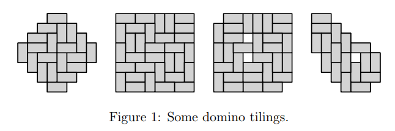
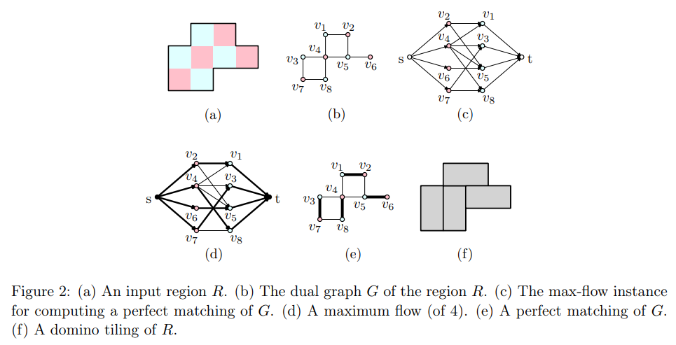
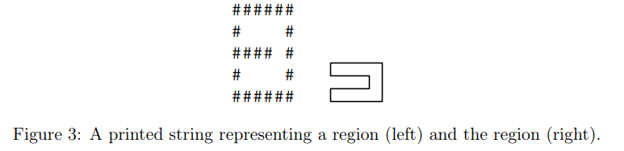

# CSCI 3333 Homework TILE: Domino Tiling
## 1 Introduction
In this homework, you’ll implement a C++ function that decides if a region can be tiled with *dominoes*: 2 × 1 pieces. Here are some examples:

The input region is given in an ASCII art “map” format similar to hwMZ1 (see Section 3), and so consists of a set of grid locations.

Consider the *dual graph* defined by the grid locations, where adjacent locations have an edge between them (see Figure 2). If we color all grid locations using a checkerboard coloring, then adjacent locations are always of opposite colors. So this dual graph is bipartite! And a tiling is a perfect matching! And the perfect matching problem for bipartite graphs can be solved using a max-flow min-cut algorithm, like Edmonds-Karp.

## 2 Instructions
The following files have been given to you:
1. A C++ header file (tiling.h) declaring the has_tiling function.
2. A C++ source file (tiling.cpp) declaring the augmenting_path and max_flow functions.
3. A C++ header file (vertex.h) declaring and implementing the Vertex class.
4. A C++ source file (main.cpp) containing a main function with tests.

Download the files [here](https://faculty.utrgv.edu/robert.schweller/CS3333/hwTILEfiles.html). Modify the provided C++ source file tiling.cpp to implements the function declared in tiling.h, so that tiling.cpp and the provided files compile into a program that runs with no failed tests. Submit the source file tiling.cpp.
## 3 Region String Format
An input region is represented as a string with the following format:
- The region consists of several lines of the same length, each terminated by the ’n’ (newline) character.
- Excluding these newline characters, all characters are either ’#’ (hash/pound), or ’ ’ (space).
- The space character denotes an empty location (i.e. part of the region).
- The hashtag character denotes a wall (i.e. not part of the region).

For instance, the string "######\n# #\n# ## #\n# #\n######\n" prints and corresponds to the region seen in Figure 3.

